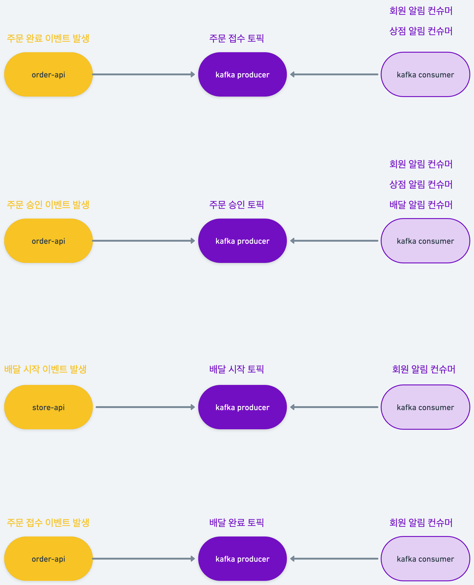

<h1>주문 메세징 시스템</h1>

<h2><b>프로젝트 설명</b></h2>

<h3>프로젝트 목적</h3>

+ 상품을 주문하는 기능을 중심으로 카프카를 이용하여 이벤트 기반 프로그래밍을 학습한다.
+ 도커 기반으로 멀티 모듈 프로젝트를 구동한다.

 

<h3>프로젝트 비즈니스 로직</h3>

+ 회원이 상품을 주문할 수 있으며, 가게는 회원의 주문을 접수하거나 거부할 수 있다.
    + 회원의 주문이 접수된 경우, 가게는 상품이 준비되면 배달을 시작한다.
+ 라이더는 상품을 받아 배달을 한다.

 

<h3>프로젝트 특징</h3>

+ 주문 관련 이벤트가 발생할 때 각 주문 상태에 적절한 트리거를 위해 토픽에 메세지를 발행한다.
    + 코어 서버에서 주문 관련 로직을 처리한 후
    + 카프카 프로듀서에 각 주문 이벤트와 관련된 메세지를 발행한다
            

 

<h3>기술 스택</h3>

+ `Java`
+ `Spring Boot`
+ `MySQL`
+ `JPA`
+ `Kafka`

 

<h3>시스템 디자인</h3>

+ <h3>주문 상태에 따른 카프카 토픽</h3>

    + <b>ORDER_COMPLETE</b>
        + 주문완료 토픽 : 회원의 주문 완료 시에 메세지가 발행되어 가게, 회원에 알림이 간다.
     
    + <b>ORDER_APPROVAL</b>
        + 주문승인 토픽 : 가게의 주문 승인 시에 메세지가 발행되어 회원에게 알림이 가고, 라이더 매칭을 호출한다.
         
    + <b>DELIVERY_START</b>
        + 배달시작 토픽 : 라이더의 배달 시작 시에 메세지가 발행되어 회원에게 알림이 간다.
         
    + <b>DELIVERY_COMPLETE</b>
        + 배달완료 토픽 : 라이더 배달 완료 시에 메세지가 발행되어 가게, 회원에게 알림이 간다.
         

 

+ <h3>카프카 로직</h3>
    

 

+ <h3>ERD</h3>
    

