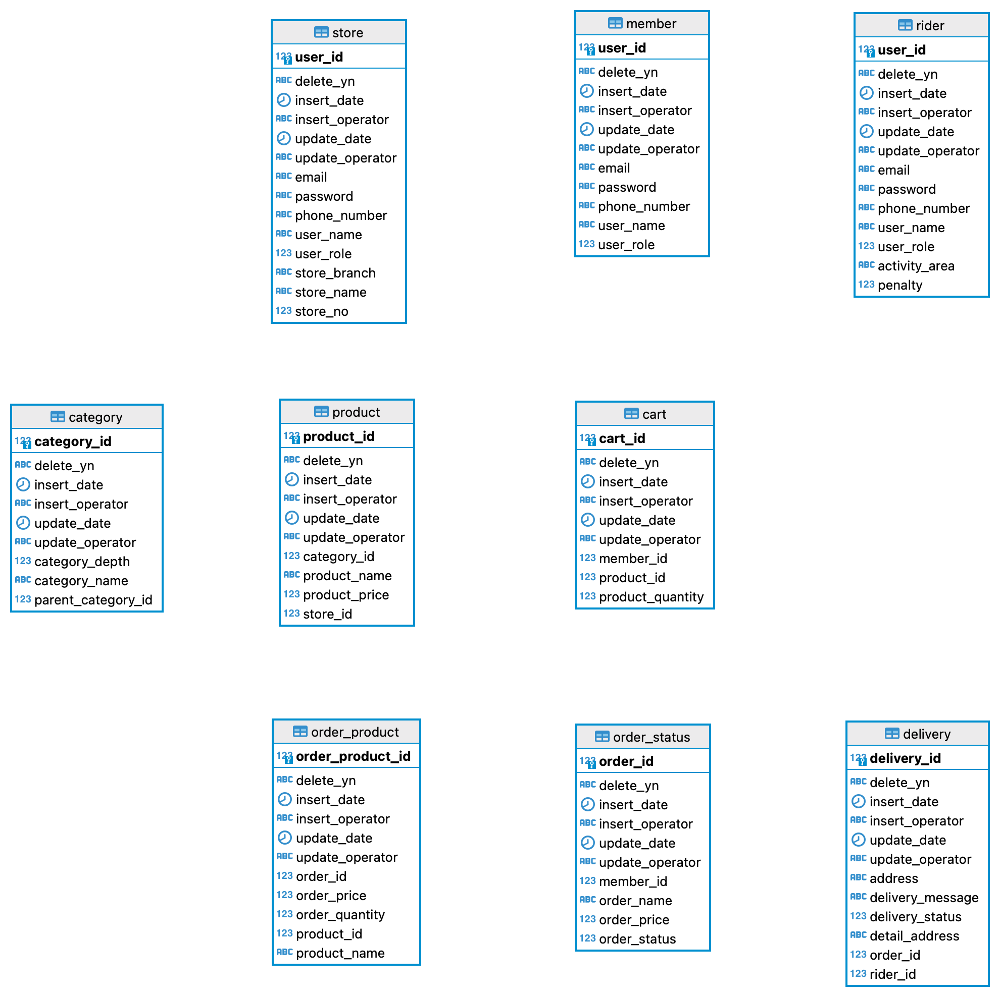

<h1>주문 메세징 시스템</h1>

<h3><b>프로젝트 설명</b></h3>

+ 프로젝트 목적
    + 상품을 주문하는 기능을 중심으로 카프카를 이용하여 이벤트 기반 프로그래밍을 학습한다.

 

+ 프로젝트 비즈니스 로직
    + 회원이 상품을 주문할 수 있으며, 가게는 회원의 주문을 접수하거나 거부할 수 있다.
        + 회원의 주문이 접수된 경우, 가게는 상품이 준비되면 배달을 시작한다.
    + 라이더는 상품을 받아 배달을 한다.

 

+ 프로젝트 특징
    + 주문 관련 이벤트가 발생할 때 각 주문 상태에 적절한 트리거를 위해 토픽에 메세지를 발행한다.
        + 본 서버에 주문 관련 데이터를 저장한 후
        + 카프카 프로듀서에 주문 이벤트와 관련된 메세지를 발행한다
            

 

<h3>기술 스택</h3>

+ Java
+ Spring Boot
+ MySQL
+ JPA
+ Kafka

 

시스템 디자인

+ 주문 상태에 따른 카프카 토픽
    + ORDER_COMPLETE; 회원의 주문 완료
        + 가게 주문 토픽
    + ORDER_APPROVAL; 가게의 주문 승인
        + 회원 주문 접수 토픽
        + 라이더 주문 접수 토픽
    + DELIVERY_START; 라이더 배달 시작
        + 회원 배달 토픽
    + DELIVERY_COMPLETE; 라이더 배달 완료
        + 배달 완료 토픽
 

+ <b>카프카 로직</b>
    + 

 

+ <b>도메인</b>
    + 

 

+ <b>ERD</b>
    + 

